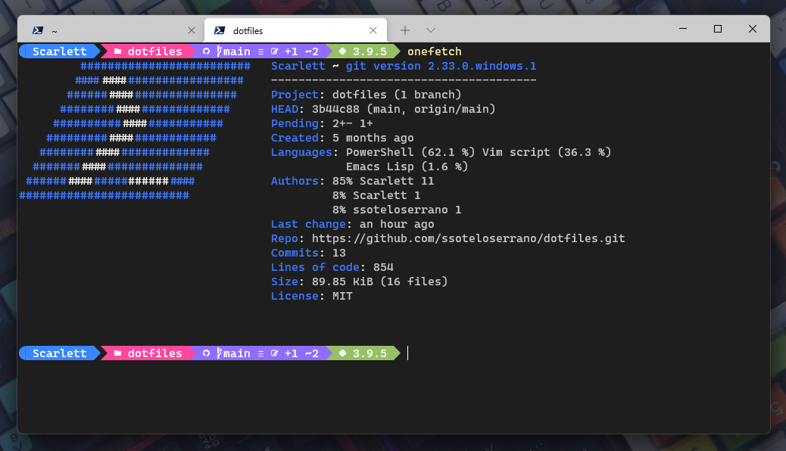
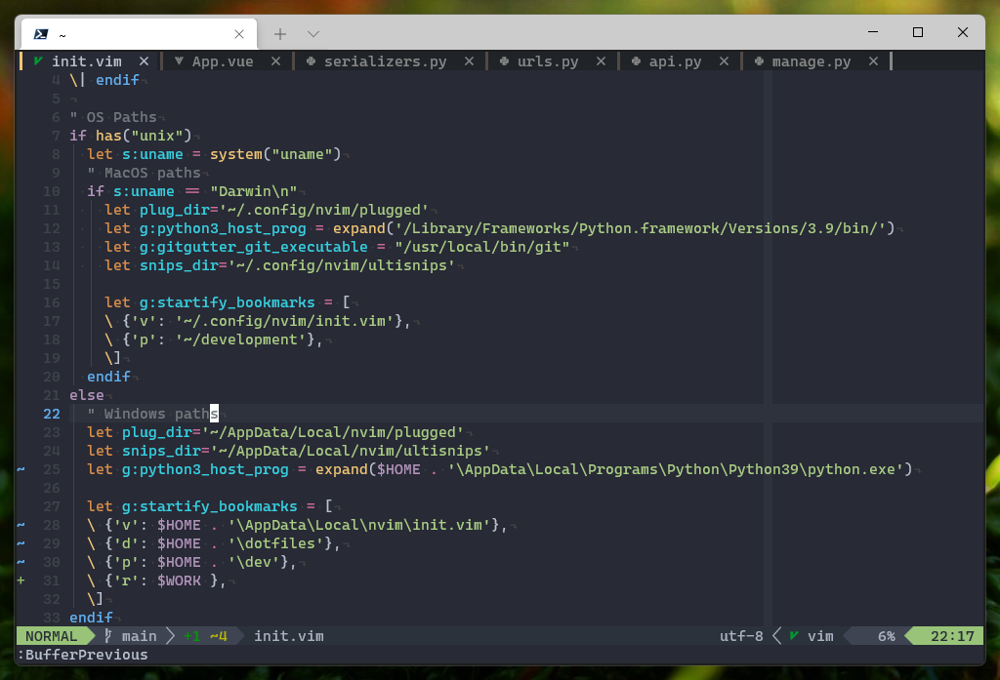
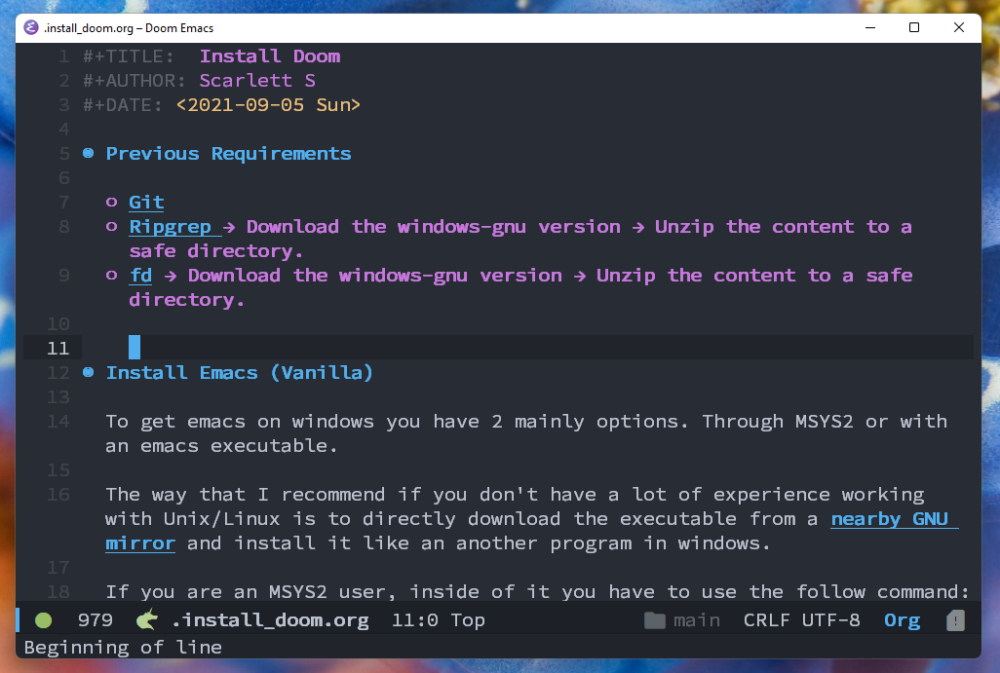

# My dotfiles

Hi everybody! These are my personal configs of Emacs and Doom Emacs, neovim and powershell.

## Emacs and Doom Emacs

I'm currently use python and org mode a lot and that is what you will see on the config.

> Important! It has taken me a lot of time to get a decent python config for windows version of emacs. The autocompletion is missing and the performance is bad as well.

## Neovim

I'm using doom-like key bindings for buffers and files... Feel free to customize the init.vim according to your personal preferences ;)

> Note: To show gitgutter signs properly in powershell you need to install the powershell module Posh-git.
